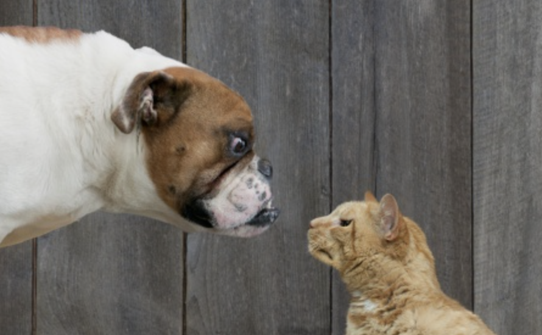
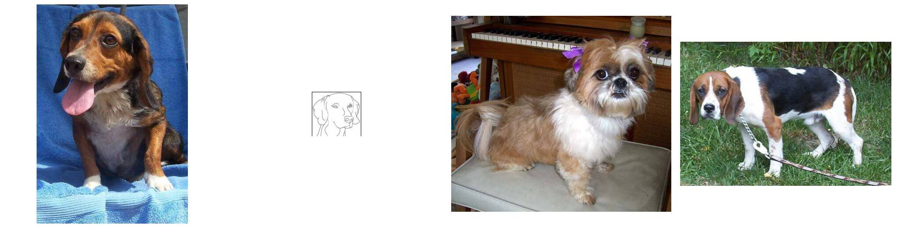

# Motivación 

Durante este capítulo se exploran distintas aplicaciones de R

## Image Recognition: Cats vs Dogs 

En 2013 se hosteó uno de los problemas más populares en la plataforma [Kaggle](www.kaggle.com/). El problema consiste en dada un conjunto de fotos de entrenamiento, poder crear un modelo que permitiera clasificar correctamenta a Gatos de Perros. Actualmente este problema ya es algo fácil de resolver y es de conocimiento popular como lograr un buen resultado en este tipo de problemas de clasificación. El siguiente código está basado en el código original del usuario de Kaggle [Tiago  Marques](https://www.kaggle.com/tfrmarques). Si es un usuario que va iniciando en R, se recomienda tomar este capítulo como motivacional, ya que tiene el grado de complejidad es medio, no adecuado para usuarios que van iniciando en R. Un ejemplo de imagenes mostradas son:




Básicamente consiste en 4 secciones:

1. Cargar librerias y funciones auxiliares
2. Dividir el conjunto inicial de datos en conjuntos de Train - Test
3. Definir y entrenar el modelo en Keras
4. Predecir para nuevas observaciones

### 1) Cargar librerias y funciones auxiliares
```{r load_libs, include=FALSE}
# En este chunk de código se cargan las distintas librerias

library(tidyverse)
library(keras)
library(imager)
library(reticulate)
library(magick)
library(tensorflow)
library(fsbrain)

use_condaenv('r-reticulate')

source("aux/dogs-vs-cats/train_prep.R")
source("aux/dogs-vs-cats/test_prep.R")
source("aux/dogs-vs-cats/extract_features.R")
source("aux/dogs-vs-cats/reshape_features.R")
source("aux/dogs-vs-cats/predict_test.R")

flag <- file.exists("lista_cats_dogs.RDS")
if(flag){
  lista <- readRDS("lista_cats_dogs.RDS")
  conv_base = lista$conv_base
  x_test = lista$x_test
  train_datagen = lista$train_datagen
  x_train = lista$x_train
  y_train = lista$y_train
  train = lista$train
  model = lista$model
  pred = lista$pred
  rm(lista)
  gc()
}

cats<- list.files(path = "data/dogs-vs-cats/train/", pattern = "cat.+")
dogs<- list.files(path = "data/dogs-vs-cats/train/", pattern = "dog.+")

size = 150
channels = 3

if(!flag){
conv_base <- application_inception_v3(
  weights = "data/dogs-vs-cats/inception_v3_weights_tf_dim_ordering_tf_kernels_notop.h5",
  include_top = FALSE,
  input_shape = c(size, size, channels)
)  
}

```

### 2) Train - Test Split
```{r data_split, include=FALSE}
if(!flag){
train <- c(cats[1:3000],dogs[1:3000])
train <- sample(train)

x_test <- test_prep(list.files(path = "data/dogs-vs-cats/test/"), size, channels)

train_datagen <- image_data_generator(rescale = 1/255)           
batch_size = 50

id <- list.files(path = "data/dogs-vs-cats/test/")
id<- gsub("dog.|cat.|.jpg", "", id)

x_train <- train_prep(train, size, channels)
y_train <- as.numeric(grepl("dog.", train, ignore.case = TRUE))

train <- extract_features(x_train, y_train, 6000)
train$features <- reshape_features(train$features)
  
}
```



### 3) Definición y entrenamiento de modelo (Keras)
```{r train, include=FALSE}
if(!flag){
model <- keras_model_sequential() %>%
  layer_dense(units = 256, activation = "relu",
              input_shape = 3 * 3 * 2048) %>%
  layer_dropout(rate = 0.5) %>%
  layer_dense(units = 1, activation = "sigmoid")
model %>% compile(
  loss = "binary_crossentropy",
  optimizer = optimizer_rmsprop(lr = 1e-4),
  metrics = c("accuracy")
)

model %>% fit(
  train$features, train$labels,
  epochs = 10
)

pred <- predict_test(ts = x_test, id = id, size = 2500)  
}
```

### 4) Predicción de nuevos datos
```{r predict, include=FALSE}
i = 1899
name <- paste0("data/dogs-vs-cats/test/",pred$ids[i],".jpg")
img <- magick::image_read(name)
ifelse(round(pred$predictions[i],digits = 0) == 1, "perro", "gato")
plot(img)
```


