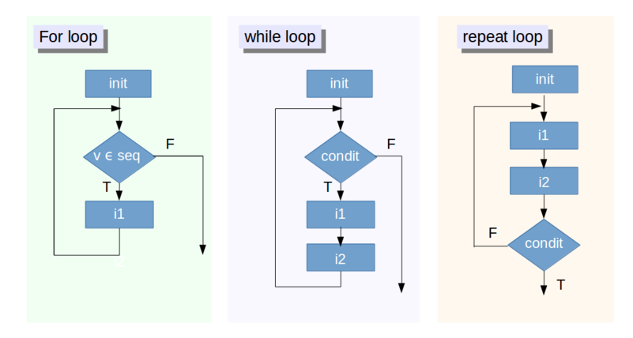

# Estructura de datos de R

## Ayuda y vignettes

1. Cada función de la paquetería instalada desde el CRAN contiene una sección de ayuda, donde se brinda la descripción de la función, los argumentos de entrada y salida y ejemplos de uso. Con el código: `help(nombre_función)` se accede a esta ayuda. 

2. Algunos paquetes contienen viñetas o **vignettes** que es una documentación más detallada del paquete. Para acceder a estas viñetas se utiliza el código: `vignette("nombre_paquete")`

3. Si se requiere información rápida de visualización, desarrollo de paquetes, conceptos básicos y avanzados de R, markdown, shiny, etc, los [Cheat sheets de RStudio](https://www.rstudio.com/resources/cheatsheets/) son una fuente fácil y rápida.

4. Si se requiere mayor documentación acerca de R, estos libros son muy útiles:

  + [R for data science](http://r4ds.had.co.nz/). Contiene documentación de la paquetería del tidyverse e información útil para manejo de datos.
  
  + [ggplot2: elegant graphics for data analysis](http://hadley.nz/). Contiene documentación de ggplot, una librería basada en el *grammar of graphics* para visualización 
  
  + [Advanced R](http://adv-r.had.co.nz/). contiene información a detalle de como funciona R.
  
  + [R packages](http://r-pkgs.had.co.nz/): contiene información que permite la creación y publicación de paquetes en R.


## Namespaces
Como el nombre lo sugiere, un *namespace* es un espacio de nombres para las funciones. En la situación óptima, cada desarrollador de paquete no debería definir nombres de funciones ya existentes, pero en la realidad es que hay paquetes que tienen funciones que se llama de la misma manera que funciones de otros paquetes (y como no hacerlo, ¡si hay más de 10,000 paquetes en el CRAN!) Ahora, ¿Cómo sabrá R a que función estamos haciendo referencia?

Para esto, es muy util saber el namespace de cada paquete. Por ejemplo, una función llamada summarize se encuentra en los paquetes Hmisc y plyr (y tiene distinta funcionalidad cada función), y si están cargados los dos, ¿Cómo hacemos referencia a cada una de estas funciones? Con el namespace:


```{r namespaces, eval=F}
# Hacer referencia a la funcion summarize() del paquete Hmisc
Hmisc::summarize()
# Hacer referencia a la funcion summarize() del paquete plyr
plyr::summarize()
```

## Paquetería útil para el análisis de datos
Gran parte del poder de R proviene de los paquetes que se pueden instalar desde el CRAN. De los paquetes más útiles para analizar datos son los siguientes:

Importar datos       |  Tratar datos    | Desarrollo de paquetes
---------------------------  | --------------------------- | ---------------------------
**ggplot2**: visualizar datos | **readr**: importar .csv y fwf | **devtools** desarrollo de paquetes
**dplyr**: manipular datos | **readxl**: importar .xlsx y .xls | **roxygen2** desarrollo de documentación
**tidyr**: ordenar datos | **haven**: importar SAP, SPSS y Stata | **testthat** para pruebas unitarias
**stringr**: trabajar con texto | **httr**: comunicarse con APIs web | 
**lubridate**: trabajar con fechas | **rvest**: scrapping websites | 


## Estructuras de datos en R

En R, al igual que otros lenguajes de programación, hay distintos tipos de estructuras de datos. Las estructuras de datos básicas en R pueden ser organizadas de acuerdo a la dimensionalidad (1d, 2d, nd) y si contienen datos homogéneos o heterogéneos (Es importante destacar que R no tiene datos de 0-dimensional (escalares). Los que parecen ser escalares son de hecho vectores de longitud uno).

Dim  | Homogeneo     | Heterogeneo
-------- | --------------------------  | --------------------------
1d           | vector atómico | lista
2d       | matriz | Data Frame
nd       | array

Datos homogéneos:

### Vectores atómicos

Son estructuras de datos homogéneas de una dimensión. Hay cuatro tipos de vectores básicos: lógicos, entero, numéricos y de caracteres.

Operaciones:

1. **Creación**: Son creados con la expresión **`c()`**

2. **Selección de elementos**: Se realiza con **`[ ]`**, indicando el índice dentro de los corchetes (es posible extraer un valor 3. indexando con números negativos)

4. **Agregar nuevo valor**: Se asigna un nuevo valor en el índice asignado.

5. **Cambiar un valor**: Se asigna el nuevo valor sobre un índice ya existente.

6. **Buscar un valor**: Usando la función **`match(vector, valor_buscado)`** se obtiene un vector lógico indicando si la posición es el valor buscado.

7. **Operaciones aritméticas**: suma, multiplicación

Algunas funciones comunes sobre vectores:

* `length`: número de elementos en el vector

* `class`: clase del vector

* `summary`: resumen de información del vector

* `unique`: valores únicos del vector

* `table`: tabla de frecuencias para cada elemento del vector

* `sum`: suma de los elementos del vector

* `mean`: promedio de elementos del vector

* `sd`: desviación estándar de los elementos del vector

* `cumsum`: suma acumulada de elemento anterior del vector

### Matrices y arrays.

Son estructuras de datos con más de una dimensión. Al igual que el vector, solamente puede contener un tipo de datos en específico. Al tener dos dimensiones, para acceder a un elemento se tiene que indexar sobre los renglones y las columnas. 

Operaciones:

1. **Creación**: Son creados con la expresión **`matrix()`**

2. **Selección de elementos**: Se realiza con **`[ , ]`**, indicando el índice de los renglones y las columnas dentro de los corchetes (es posible extraer un valor indexando con números negativos)

3. **Agregar nuevo valor**: Se asigna un nuevo valor en los índice asignados.

4. **Cambiar un valor**: Se asigna el nuevo valor sobre un índices ya existente.

5. **Buscar un valor**: Usando la función **`match(matriz, valor_buscado)`** se obtiene un vector numérico indicando si la posición es el valor buscado.

6. **Operaciones aritméticas**: suma, multiplicación

Algunas funciones comunes sobre matrices:

* `dim`: dimensión de una matriz 

* `nrow`: número de renglones de la matriz

* `rownames`: devuelve el nombre de los renglones

* `rbind`: une los renglones de dos matrices del mismo tipo con el mismo número de columnas

* `ncol`: número de columnas de la matriz

* `colnames`: devuelve el nombre de las columnas

* `cbind`: une las columnas de dos matrices del mismo tipo con el mismo número de renglones

* `t`: para obtener la matriz transpuesta

* `diag`: depende del argumento,

    - Si se da un vector como argumento, regresa una matriz diagonal con los elementos del 
      vector como las entradas de la diagonal.
      
    - Si se da una matriz como argumento, regresa un vector que contiene
      los elementos de la diagonal de la matriz. 
      
    - Si se da un valor numérico, regresa la matriz 
      identidad multiplicada por dicho valor. 

### Listas.
Una lista puede contener elementos de distinto tipo. Por ejemplo, un elemento puede ser numérico, otro puede ser una cadena de texto y otro un elemento booleano. Inclusive, un elemento de una lista puede ser otra lista.

Operaciones:

1. **Creación**: Son creados con la expresión **`list()`**

2. **Selección de elementos**: Se realiza con **`[[ ]]`**, indicando el índice dentro de los corchetes (**NO** es posible extraer un valor indexando con números negativos)

3. **Agregar nuevo valor**: Se asigna un nuevo valor en el índice asignado y usando **`[[ ]]`**.

4. **Cambiar un valor**: Se asigna el nuevo valor sobre un indice ya existente y usando **`[[ ]]`**.

5. **Buscar un valor**: Usando la función **`match(vector, valor_buscado)`** se obtiene un vector lógico indicando si la posición es el valor buscado.

Algunas funciones comunes sobre listas:

* `length`: número de elementos en la lista

* `class`: devuelve la clase lista

* `unique`: valores únicos del vector

* `unlist`: vuelve un vector la lista. (tener cuidado por que cambia el formato de los datos)

### Data.frames

Un **data.frame** es un conjunto de vectores del mismo tamaño agrupados en una tabla. Son estructuras rectangulares donde cada columna tiene elementos de la misma clase, pero entre columnas pueden tener diferentes clases.


Operaciones:
1. **Creación**: Son creados con la expresión **`data.frame()`**

2. **Selección de elementos**: Se puede seleccionar una columna entera con el símbolo **`$`** y el nombre de la columna: **`dataframe$variable_nombre`**, se puede seleccionar un elemento en particular al igual que una matriz.

3. **Agregar una nueva columna**: Se puede asignar una nuevo vector del mismo tamaño como una columna nueva.
**`dataframe$variable_nombra =  vector_nuevo`**

Algunas funciones comunes sobre data frames:

* `dim`: dimensión de una data.frame 

* `nrow`: número de renglones de un data.frame

* `rownames`: devuelve el nombre de los renglones

* `rbind`: une los renglones de dos data.frames del mismo tipo con el mismo número de columas

* `ncol`: número de columnas de un data.frame

* `colnames`: devuelve el nombre de las columnas

* `cbind`: une las columnas de dos data.frames del mismo tipo con el mismo número de renglones

* `summary`: se obtiene el resumen de los datos.

## Funciones, condicionales e iteraciones:
Al igual que en otros lenguajes de programación, existen 

### Funciones

Una función en R es muy parecido a una función común. Recibe unos parámetros de entrada, los cuales usa para arrojar otros de salida. Los objetos creados dentro de la función son *locales*, es decir, solamente existen dentro del *scope* de la función. Si se quiere exportar algún valor, o lista se tiene que mencionar explicitamente. (Por default, las funciones en R devuelven la última linea del código siempre y cuando no sea una asignación). La sintaxis es la siguiente:

```{r funcion, eval=T, warning=FALSE}
 mi_funcion <- function(valor){
   valor_exportado <- 5
   valor_no_exportado <- valor
   valor_exportado
 }
 mi_funcion(10)
```

### Condicionales

Otra estructura muy explotada en los lenguajes de programación son los condicionales. Los principales en R son `dplyr::if_else` y `dplyr::case_when`. El primero evalua si una expresión es verdadera o falsa y da distinto resultado en caso de ser verdadero y uno en caso de ser falso. El segundo vectoriza multiples condicionales `if`. Por ejemplo:

```{r libraries, eval=T,  echo=F}
suppressMessages(library(dplyr))
```

```{r libraries_echo, eval=F,  echo=T}
library(dplyr)
```

```{r if_else, eval=T}
x <- c(-5:5, NA)
if_else(x < 0, NA_integer_, x)
if_else(x < 0, "negativo", "positivo", "faltante")
```

```{r case_when, eval=T, warning=FALSE}
edad <- 1:10
case_when(
  edad > 35 ~ "adulto",
  edad > 20 ~ "adulto joven",
  edad > 10 ~ "adolescente",
  TRUE ~ "niño"
)
```


### Iteraciones

Las iteraciones en cualquier lenguaje de programación son básicamente replicar un código múltiples veces con el mismo o distintos argumentos. En R los más básicos son los ciclos `for`, `while` y `repeat`:

Como se observa en la imagen, el ciclo **for** se ejecuta n veces con n conocido (o bien, sobre un vector ya conocido). Por otra parte, un ciclo **while** se ejecuta mientras una condición se cumpla, por lo que teóricamente puede seguir iterando mientras no se cumpla dicha condición. Finalmente, en el ciclo **repeat** se repite el código hasta que explicitamente se salga del código con un comando llamado **break**. Los dos comandos faltantes son **next** y **break**. El primero sirve para terminal la iteración actual y continuar con la siguiente, mientras que el segundo sirve para salir por completo del ciclo.

```{r for_while_repeat, eval=T, warning=FALSE}
# ejemplos de for:
for (numero in 1:3){
  print(paste("El número es", numero))
}
for (anio in c(2015,2016,2017,2018)){
  print(paste("El año es", anio))
}
# ejemplo de while
i <- 1
while (i < 6) {
  print(i)
  i = i+1
}
# ejemplo de repeat (con break)
x <- 1
repeat {
  print(x)
  x = x+1
  if (x == 6){
  break
  }
}
# ejemplo de repeat (con break y next)
x <- 1
repeat {
  if (x == 3){
    x = x+1
    next
  }
  print(x)
  x = x+1
  if (x == 6){
  break
  }
}
```


#### Familia apply (base package)

Las funciones de la familia *apply: apply(), lapply(), sapply(), mapply()* sirven para iterar sobre datos en matrices, arrays, listas y data.frames con muy pocas lineas de código. 

La manera de usar cada una de estas funciones es la siguiente:

`apply(X, MARGIN, FUN, ...)`: funciona sobre arrays, con *MARGIN* la dimension sobre la cual se aplicara una funcion *FUN*


```{r apply, eval=T, warning=FALSE}
m <- matrix(c(1:10, 11:20), nrow = 10, ncol = 2)
apply(m, 1, mean)
apply(m, 2, mean)
```

`lapply(X, FUN, ...)`: es muy similar a *apply()*, pero toma una lista como entrada y regresa una lista como salida
```{r lapply, eval=T, warning=FALSE}
l <- list(a = 1:10, b = 11:20)
lapply(l, mean)
lapply(l, sum)
```

`sapply(X, FUN, ...)`: es basicamente igual a *lapply()*, pero la salida no es una lista, si no un vector, matriz o array (el que sea más apropiado). En mi opinión, esta función debe evitarse ya que hay incertidumbre en el formato de salida al aplicarla.

```{r sapply, eval=T, warning=FALSE}
l <- list(a = 1:10, b = 11:20)
sapply(l, mean)
```

`mapply(X, FUN, ...)`: es una versión multivariada de *sapply()*. Se aplica la funcion *FUN* al primer elemento de cada argumento, del segundo elemento, del tercer elemento, etc.

```{r mapply, eval=T, warning=FALSE}
l1 <- list(a = c(1:10), b = c(11:20))
l2 <- list(c = c(21:30), d = c(31:40))
mapply(sum, l1$a, l1$b, l2$c, l2$d)
```

Aunque en cuando a performance no hay ventaja en usar la familia `apply()`, se tienen otras ventajas como:

1. Se crea un código más legible (no se tienen que preocuparse por manejar el output, ni por problemas de corchetes)

2. Se permite crear código más rápido (una vez dominada la familia `apply`) Como se mencionó antes, R esta basádo en vectores, matrices, arrays, lists y data.frames, por lo que esta familia de funciones está diseñada para trabajar con estas estructuras de datos.

Las principales desventajas sobre la familia `apply()` son las siguientes:

1. No son estables en el tipo de salida (no sabes si se generará un vector de carácteres, numérico, de booleanos, etc).

2. No está estandarizado el orden de los argumentos.

Estas debilidades de la familia `apply()` motivaron la creación de otra familia más reciente: la familia `map()` del paquete `purrr`, que se abordará a continuación.

#### familia `map()` (purrr package)
***
`map()`, `map_if()`, `map_at()`: itera sobre un vector o lista y retorna una lista.
```{r libraries purrr, eval=T,  echo=F}
suppressMessages(library(purrr))
```

```{r libraries_echo purrr, eval=F,  echo=T}
library(purrr)
```

```{r map, eval=T, warning=FALSE}

# ejemplo de map original
map(c(9, 16, 25), sqrt)


# ejemplo de map_if
es_par <- function(x){
  !as.logical(x %% 2)
}

numbers <- list(11, 12, 13, 14)

map_if(numbers, es_par, sqrt)

# ejemplo de map_at
map_at(numbers, c(1,3), sqrt)
```
***
`map_chr()`, `map_dbl()`, `map_int()`, `map_lgl()`: itera sobre un vector o lista y retorna un vector de caracteres, numérico, de enteros o booleano.
```{r map_type, eval=T, warning=FALSE}
# el orden de transformación es lgl -> int -> dbl -> chr 

# por ejemplo un dbl no puede transformarse en un int, pero si en un chr
map_chr(c(9, 16, 25), sqrt)
map_dbl(c(9, 16, 25), sqrt)

# por ejemplo un lgl puede transformarse en un int, en un dbl y en un chr

map_chr(c(TRUE, FALSE, TRUE), identity)
map_dbl(c(TRUE, FALSE, TRUE), identity)
map_int(c(TRUE, FALSE, TRUE), identity)
map_lgl(c(TRUE, FALSE, TRUE), identity)
```
***
`map2()`, `pmap()`: Son un variante de la funcion `map()` que permite iterar sobre multiples argumentos en paralelo.

```{r map2, eval=T, warning=FALSE}
numbers2 <- list(1, 2, 3, 4)

map2(numbers, numbers2, `+`)
pmap(list(numbers, numbers2, numbers2), sum)

```
***
`map_dfr()` y `map_dfc()`: regresa data.frames creados por concatenación de renglones o de columnas (respectivamente)

## Ejercicios de practica

### Ejercicio 3

Tipo de datos: String, double, integer, boolean
Vector Atomico: vector con elementos del mismo tipo (string, double, entero)
Matrix: vector de dos dimensiones con elementos del mismo tipo (string, double, entero)
Lista: unidimensional elementos de distinto tipo (string, double, entero)
Dataframe: multidimensional que nos permite almacenar una tabla o base de datos en R. Se compone de columnas y renglones   

Tipos de dato:
```{r}
soy_string <- "Hola soy una cadena de texto"
soy_double <- 5.3
soy_integer <- 5
soy_boolean <- TRUE
```

Vector atómico:
```{r}
soy_vector_atomico <- c(1,2,3)  
var(soy_vector_atomico)
mean(soy_vector_atomico)
length(soy_vector_atomico)
```

Matriz:
```{r}
soy_matrix <- matrix(c(1,2,3,4), ncol = 2)
mean(matrix)
dim(matrix)
```

Lista:
```{r}
soy_lista <- list(1, "texto", 1.5, 1)
length(soy_lista)
unique(soy_lista)
```


Dataframe:
```{r}
soy_data_frame <- data.frame(col1 = c("text1", "text2"), col2 = c(1,2))
dim(soy_data_frame)
colnames(soy_data_frame)
summary(soy_data_frame)
```


Operaciones comunes dataframe:
```{r}
head(mtcars, 5) # obtiene primeros 5 registros
tail(mtcars, 5) # obtiene ultimos 5 registros
```
  
al operador %>% (en paquete magrittr) se le conoce como pipe, sirve para pasar datos (en un substituto de anidación):
```{r}
install.packages("magrittr", repo="http://cran.rstudio.com/")
```

```{r}
library(magrittr)
tail(head(mtcars, 10), 5)
mtcars %>% head(10) %>% tail(5)
mtcars %>% head(5)
mtcars %>% tail(5) 
```

