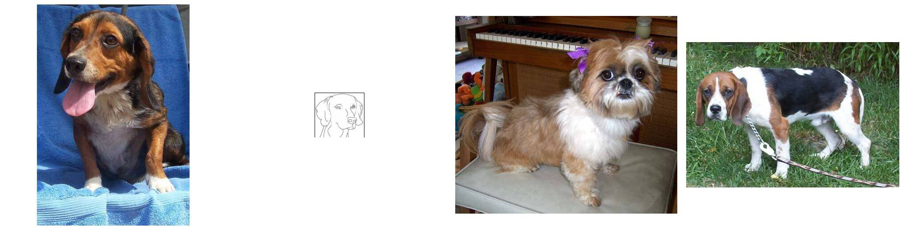
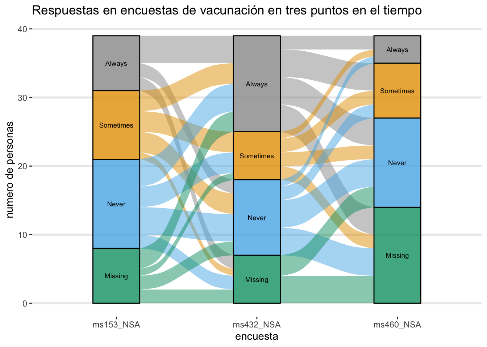

# Motivación

Durante este capítulo se exploran distintas aplicaciones de R

## Image Recognition: Cats vs Dogs 

En 2013 se hosteó uno de los problemas más populares en la plataforma [Kaggle](www.kaggle.com/). El problema consiste en dada un conjunto de fotos de entrenamiento, poder crear un modelo que permitiera clasificar correctamenta a Gatos de Perros. Actualmente este problema ya es algo fácil de resolver y es de conocimiento popular como lograr un buen resultado en este tipo de problemas de clasificación. El siguiente código está basado en el código original del usuario de Kaggle [Tiago  Marques](https://www.kaggle.com/tfrmarques). Si es un usuario que va iniciando en R, se recomienda tomar este capítulo como motivacional, ya que tiene el grado de complejidad es medio, no adecuado para usuarios que van iniciando en R. Un ejemplo de imagenes mostradas son:


Básicamente consiste en 4 secciones:

1. Cargar librerias y funciones auxiliares
2. Dividir el conjunto inicial de datos en conjuntos de Train - Test
3. Definir y entrenar el modelo en Keras
4. Predecir para nuevas observaciones

### 1) Cargar librerias y funciones auxiliares


### 2) Train - Test Split




### 3) Definición y entrenamiento de modelo (Keras)


### 4) Predicción de nuevos datos


## Motivación Data Visualization

R tiene un framework para crear gráficas que (creo yo) es de los más versátiles para cosas estáticas. Este framework es llamado ggplot. Además de ese framework cuenta con otros como lattice o base, pero en general están en desuso. 


```r
library(alluvial)
library(ggalluvial)
library(magrittr)
data(vaccinations)
cbPalette <- c("#999999", "#E69F00", "#56B4E9", "#009E73", "#F0E442",
               "#0072B2", "#D55E00", "#CC79A7")
levels(vaccinations$response) <- rev(levels(vaccinations$response))
vaccinations %>% ggplot(
  aes(x = survey, 
      fill = response,
      stratum = response, 
      alluvium = subject,
      weight = freq)) +
  geom_flow() +
  geom_stratum(alpha = .8) +
  geom_text(stat = "stratum", infer.label = TRUE, size = 2.5) +
  theme_bw() + theme(legend.position = "none", 
                     panel.background = element_rect(fill = NA),
                     panel.grid.major.y = element_line(size = 1),
                     panel.grid.major.x = element_line(size = 0),
                     panel.grid.minor = element_line(size = 0),
                     axis.line = element_line(size = 0),
                     panel.border = element_rect(size = 0)) +
  scale_fill_manual( values = c(cbPalette, "#999999", "#999999")) +
  theme(legend.position = "none") +
  labs(title = "Respuestas en encuestas de vacunación en tres puntos en el tiempo", 
       x = "encuesta", y = "numero de personas")
```

```
## Warning: The parameter `infer.label` is deprecated.
## Use `aes(label = after_stat(stratum))`.
```




Si notan, el texto para crear la grafíca es largo y parece dificil, pero con practica todos estos comandos se vuelven intuitivos. Para esta intro a visualización de datos, solamente veremos diferentes tipos de gráficas y en capitulos siguientes profundizaremos en creación de gráficas. Además veremos conceptos básicos de bases de datos.
