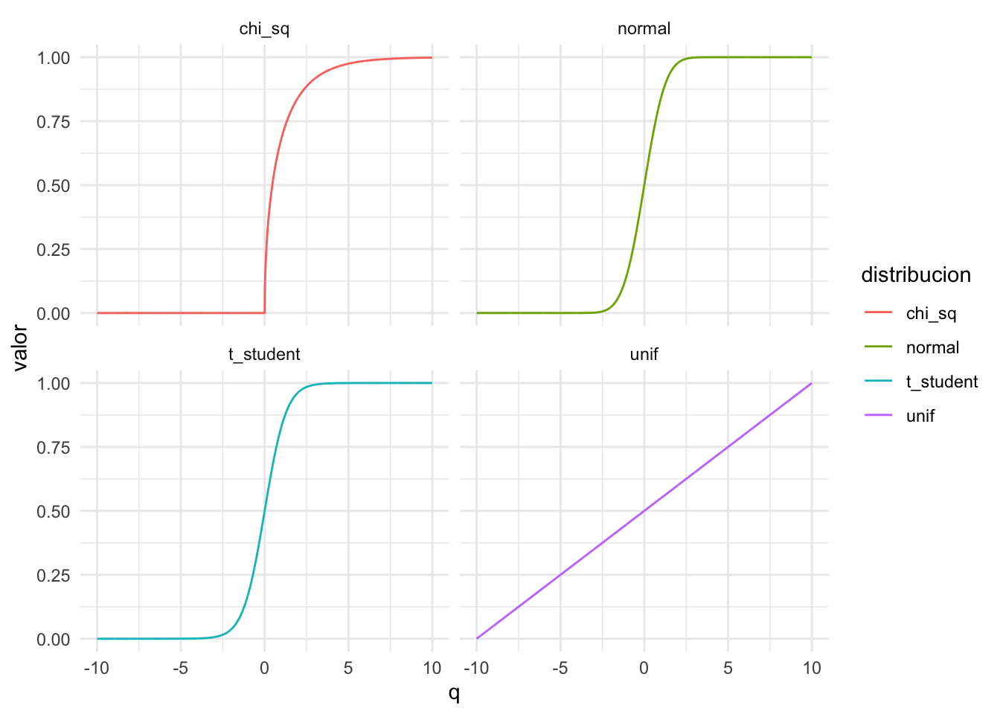
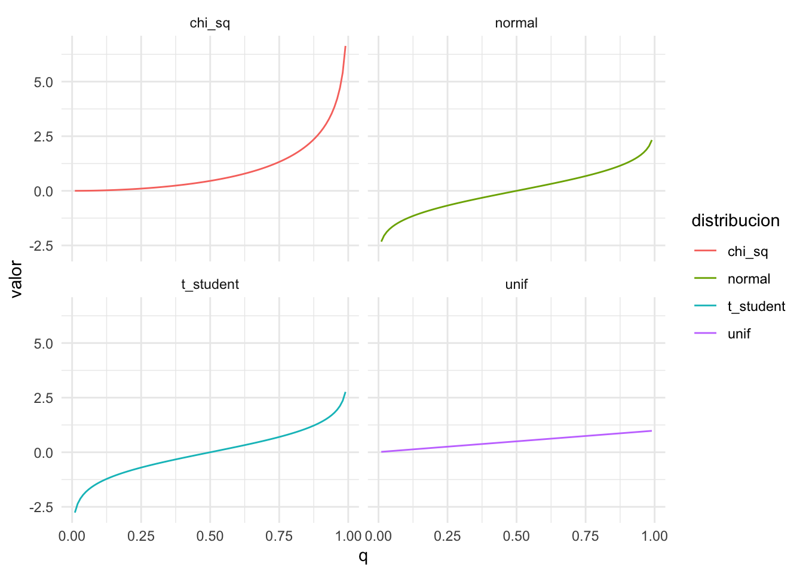
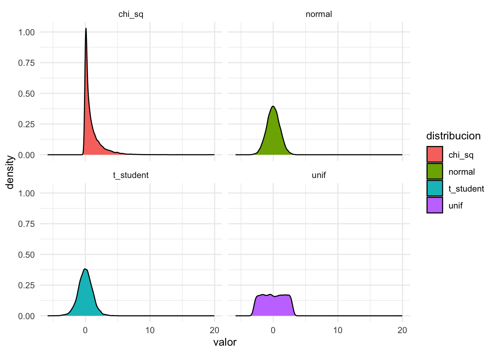

# Introducción a estadística


```r
library(crayon)
library(tidyverse)
```

```
## ── Attaching packages ─────────────────────────────────────── tidyverse 1.3.0 ──
```

```
## ✓ ggplot2 3.3.2     ✓ purrr   0.3.4
## ✓ tibble  3.0.4     ✓ dplyr   1.0.2
## ✓ tidyr   1.1.2     ✓ stringr 1.4.0
## ✓ readr   1.4.0     ✓ forcats 0.5.0
```

```
## ── Conflicts ────────────────────────────────────────── tidyverse_conflicts() ──
## x ggplot2::%+%()  masks crayon::%+%()
## x dplyr::filter() masks stats::filter()
## x dplyr::lag()    masks stats::lag()
```

```r
library(Hmisc)
```

```
## Loading required package: lattice
```

```
## Loading required package: survival
```

```
## Loading required package: Formula
```

```
## 
## Attaching package: 'Hmisc'
```

```
## The following objects are masked from 'package:dplyr':
## 
##     src, summarize
```

```
## The following objects are masked from 'package:base':
## 
##     format.pval, units
```

```r
library(plyr)
```

```
## ------------------------------------------------------------------------------
```

```
## You have loaded plyr after dplyr - this is likely to cause problems.
## If you need functions from both plyr and dplyr, please load plyr first, then dplyr:
## library(plyr); library(dplyr)
```

```
## ------------------------------------------------------------------------------
```

```
## 
## Attaching package: 'plyr'
```

```
## The following objects are masked from 'package:Hmisc':
## 
##     is.discrete, summarize
```

```
## The following objects are masked from 'package:dplyr':
## 
##     arrange, count, desc, failwith, id, mutate, rename, summarise,
##     summarize
```

```
## The following object is masked from 'package:purrr':
## 
##     compact
```

```r
px = 14/488
py = 5/488

# Z (simetrica)
qnorm(.025, lower.tail = T)
```

```
## [1] -1.959964
```

```r
qnorm(.025, lower.tail = F)
```

```
## [1] 1.959964
```

```r
## Valor-p
pnorm(-1.959964, lower.tail = T)
```

```
## [1] 0.025
```

```r
# T (simetrica)
qt(.025, df = 11, lower.tail = T)
```

```
## [1] -2.200985
```

```r
qt(.025, df = 11, lower.tail = F)
```

```
## [1] 2.200985
```

```r
# J (no simetrica)
qchisq(.025, df = 11, lower.tail = T)
```

```
## [1] 3.815748
```

```r
qchisq(.025, df = 11, lower.tail = F)
```

```
## [1] 21.92005
```

```r
# J (no simetrica)
qf(.025, df1 = 11, df2 = 38, lower.tail = T)
```

```
## [1] 0.3256995
```

```r
qf(.025, df1 = 11, df2 = 38, lower.tail = F)
```

```
## [1] 2.35346
```


# Estadística básica

Para esta sección de estadística básica veremos funciones asociadas a distribuciones. Estas son de 4 tipos para varios tipos de distribución:


```r
# dnorm, dt, dchisq, df funcion de distribución de la normal, t-student, chisquared, f 
# Nos dice la 'altura' en los puntos dados. Para distribuciones continuas no es muy util, pero para discretas si
dnorm(x = c(-100, -1, 0, 1, 100),mean = 0, sd = 1)
```

```
## [1] 0.0000000 0.2419707 0.3989423 0.2419707 0.0000000
```

```r
dbinom(x = c(0,1,2), size = 2, prob = .5)
```

```
## [1] 0.25 0.50 0.25
```


```r
# qnorm, qt, qchisq, qf la funcion quantile de las distribuciones. Recibe como argumento la probabilidad y devuelve el valor del quantil
qnorm(p = c(0,.5,1), mean = 0, sd = 1) # en que valor te acumula 0%, 50% y 100%
```

```
## [1] -Inf    0  Inf
```


```r
# pnorm, pt, pchisq, pf la funcion inversa a la quantile. cuanta probabilidad te acumula en los valores dados
pnorm(q = c(-Inf, 0, Inf), mean = 0, sd = 1)
```

```
## [1] 0.0 0.5 1.0
```


```r
# rnorm, rt, rchisq, rf te devuelve random samples de la distribución en cuestión
rnorm(n = 10, mean = 0, sd = 1)
```

```
##  [1]  0.97432866  0.68381780 -0.08481466  0.55714704  0.45892864  0.67165111
##  [7] -2.12357576 -0.13225830  1.03125269 -0.72852431
```

## Ejercicios de práctica
### Ejercicio 10

```r
library(tidyverse)
  data.frame(x = c(seq(-10, 10, by = .01))) %>% 
    mutate(
      normal = dnorm(x = x, mean = 0, sd = 1),
      t_student = dt(x = x, df = 10),
      chi_sq = dchisq(x = x, df = 10),
      unif = dunif(x = x, min = min(x), max = max(x))
      ) %>% 
    gather(distribucion, valor, normal:unif) %>% 
    ggplot(aes(x = x, y = valor, color = distribucion))+
    geom_line()+
    facet_wrap(~distribucion, ncol = 2)+
    theme_minimal()
```


### Distribution function

```r
data.frame(q = c(seq(-10, 10, by = .01))) %>% 
    mutate(
      normal = pnorm(q = q, mean = 0, sd = 1),
      t_student = pt(q = q, df = 10),
      chi_sq = pchisq(q = q, df = 1),
      unif = punif(q = q, min = min(q), max = max(q))
    ) %>% 
    gather(distribucion, valor, normal:unif) %>% 
    ggplot(aes(x = q, y = valor, color = distribucion))+
    geom_line()+
    facet_wrap(~distribucion, ncol = 2)+
    theme_minimal()
```


 
### Quantile function


```r
data.frame(q = c(seq(0.01, .99, by = .01))) %>% 
    mutate(
      normal = qnorm(p = q, mean = 0, sd = 1),
      t_student = qt(p = q, df = 10),
      chi_sq = qchisq(p = q, df = 1),
      unif = qunif(p = q, min = min(q), max = max(q))
    ) %>% 
    gather(distribucion, valor, normal:unif) %>% 
    ggplot(aes(x = q, y = valor, color = distribucion))+
    geom_line()+
    facet_wrap(~distribucion, ncol = 2)+
    theme_minimal()
```



### Random function

```r
data.frame(
      normal = rnorm(n = 10000, mean = 0, sd = 1),
      t_student = rt(n = 10000, df = 10),
      chi_sq = rchisq(n = 10000, df = 1),
      unif = runif(n = 10000, min = -3, max = 3)
    ) %>% 
    gather(distribucion, valor, normal:unif) %>% 
    ggplot(aes(x = valor, fill = distribucion))+
    geom_density()+
    facet_wrap(~distribucion, ncol = 2)+
    theme_minimal()
```




